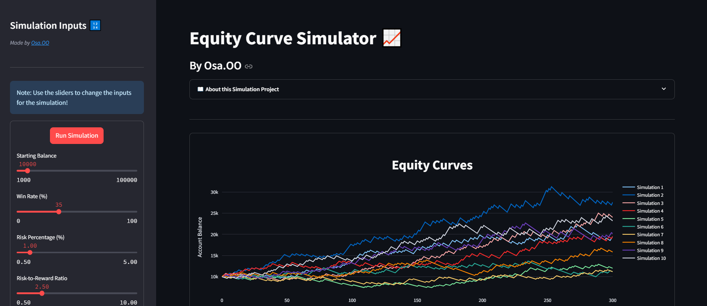

# Equity Curve Simulator

Welcome to the Equity Curve Simulator! This tool is designed for traders and investors to visualize and understand the potential outcomes of their trading strategies over a series of trades. By simulating equity curves, you can gain insights into the performance and risk of your strategy under various market conditions.



## Features
- **Interactive Inputs**: Adjust the starting balance, win rate, risk percentage, risk-to-reward ratio, number of trades, and number of simulations using intuitive sliders.
- **Quick Simulation**: Instantly see the impact of your input parameters on the equity curve with dynamic simulations.
- **Visual Representation**: View multiple equity curves on a single graph to compare different simulations and identify patterns.
- **User-Friendly Interface**: Enjoy a modern and responsive design, making it easy to navigate and use.

## How It Works
1. **Starting Balance**: Set the initial amount of capital you want to start with.
2. **Win Rate**: Define the percentage of trades you expect to win.
3. **Risk Percentage**: Choose the percentage of your capital you are willing to risk per trade.
4. **Risk-to-Reward Ratio**: Specify the ratio of potential profit to potential loss for each trade.
5. **Number of Trades**: Determine the number of trades to simulate.
6. **Number of Simulations**: Select how many different simulations you want to run to compare potential outcomes.

## Purpose
The Equity Curve Simulator helps traders evaluate the robustness and viability of their trading strategies by simulating the financial outcomes over a series of trades. It serves as a valuable tool for risk management and strategic planning, enabling you to make informed decisions based on simulated performance data.
### Disclaimer 
The Equity Curve Simulator is intended for educational and informational purposes only. The simulations generated by this tool are based on user-defined parameters and random outcomes. They do not represent actual trading results and should not be construed as financial advice. Trading involves substantial risk and is not suitable for every investor. Always conduct your own research and consult with a licensed financial advisor before making any trading decisions.

## Installation
To run the Equity Curve Simulator, you'll need to have Python installed along with the necessary libraries. Follow these steps:
1. Clone the repository:
    ```sh
   git clone https://github.com/your-username/equity-curve-simulator.git
2. Navigate to the project directory:
    ```sh
    cd equity-curve-simulator
3. Install the required packages:
    ```sh
    pip install -r requirements.txt
4. Run the Streamlit app:
    ```sh
    streamlit run app.py
